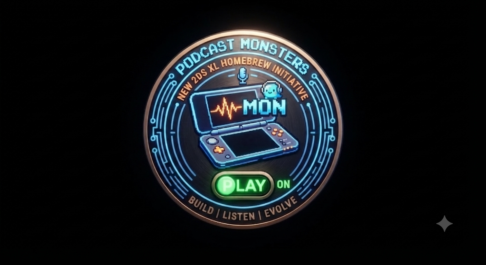

# PodMon
WIP Podcast shit app for N2DSXL consoles

# PodMon: Podcast Monsters

> A custom homebrew podcast application for the Nintendo 2DS XL, combining retro role-playing aesthetics with offline audio consumption.

## Overview

**PodMon** is a lightweight, purpose-built homebrew initiative designed to turn your New 2DS XL into a dedicated, distraction-free podcast player. Built natively using `libctru` and DevkitPro, PodMon bypasses heavy system overhead to deliver direct audio playback from local feeds stored right on your SD card.

---

## Features

- **Native Audio Playback:** Clean, low-level WAV/MP3 rendering designed for the 3DS hardware architecture.
- **Minimalist UI:** Built for the dual-screen layout, offering straightforward menu navigation and classic playback controls.
- **Dock-Friendly Design:** Optimized to sit comfortably on your desktop charging cradle for seamless daily use.
- **Zero Bloat:** Focused strictly on core audio playback without background battery drain.

---

## Milestone Tracker

- [ ] **Environment Setup:** DevkitPro & libctru toolchain verification
- [ ] **Hardware Bridge:** Confirm USB connectivity and dock power-flow
- [ ] **Audio Engine:** Implement wav/mp3 playback using `libctru`/`miniaudio`
- [ ] **Parsing Layer:** RSS/XML feed fetcher (static file parsing first)
- [ ] **UI Architecture:** Basic menu list and playback controls
- [ ] **Alpha Test:** Play one full podcast episode natively

---

## Getting Started

1. Set up your **DevkitPro** and `libctru` development environment.
2. Clone this repository and configure your build paths.
3. Compile the `.cia` / `.3dsx` binary and deploy it to your homebrew-enabled New 2DS XL.

## License

This project is open-source and built for educational and personal homebrew use.